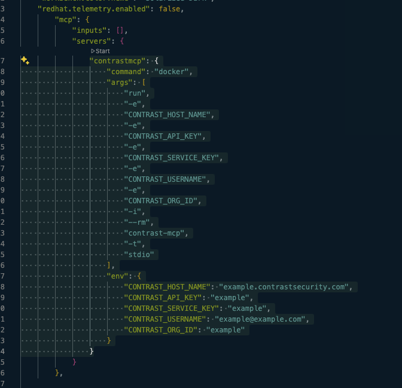
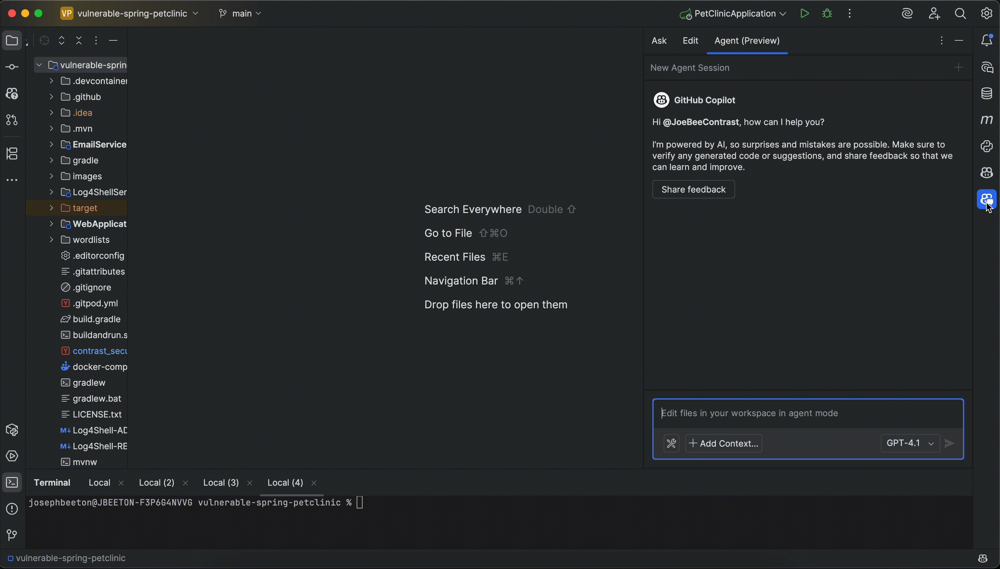
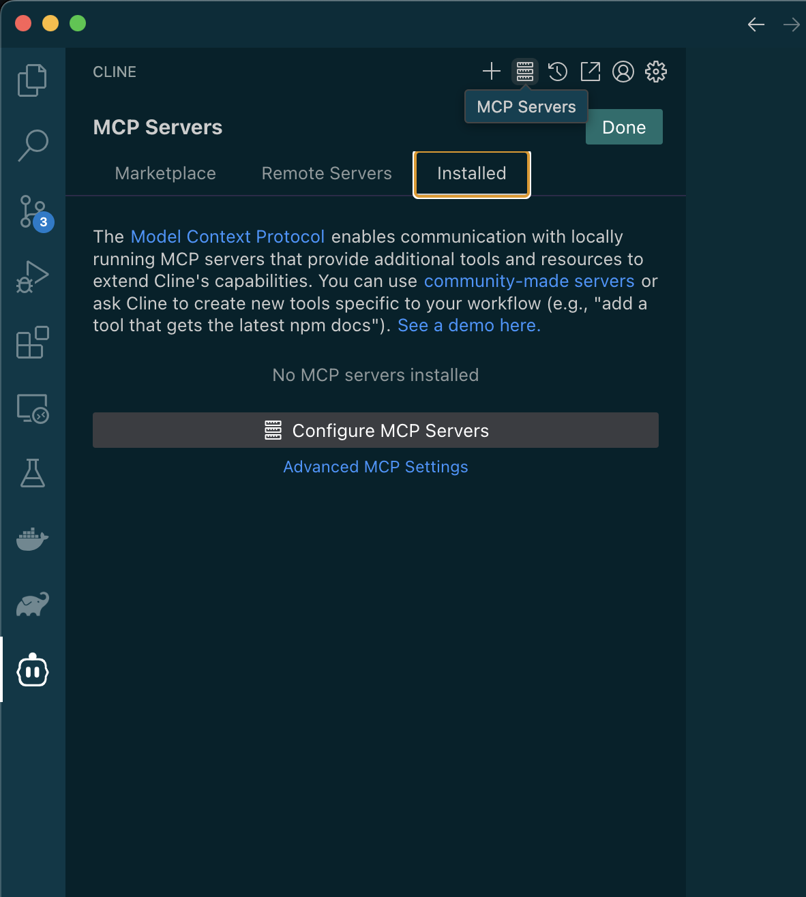
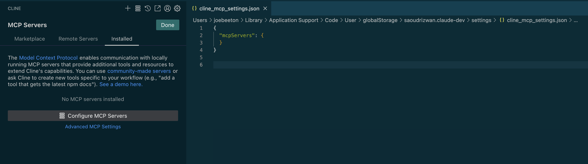
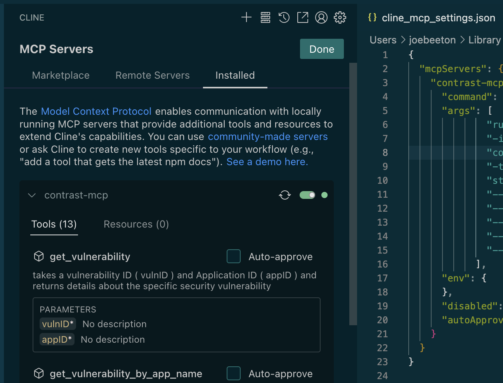
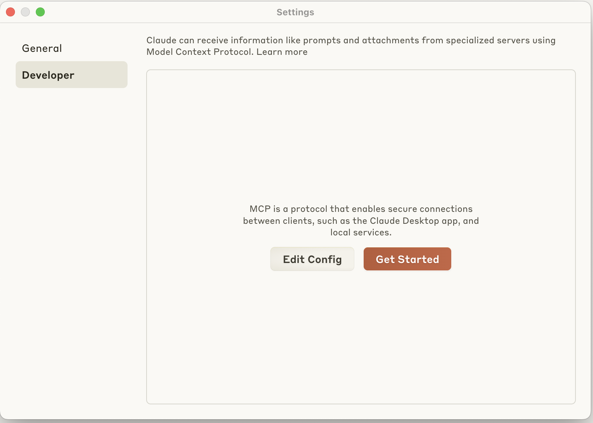
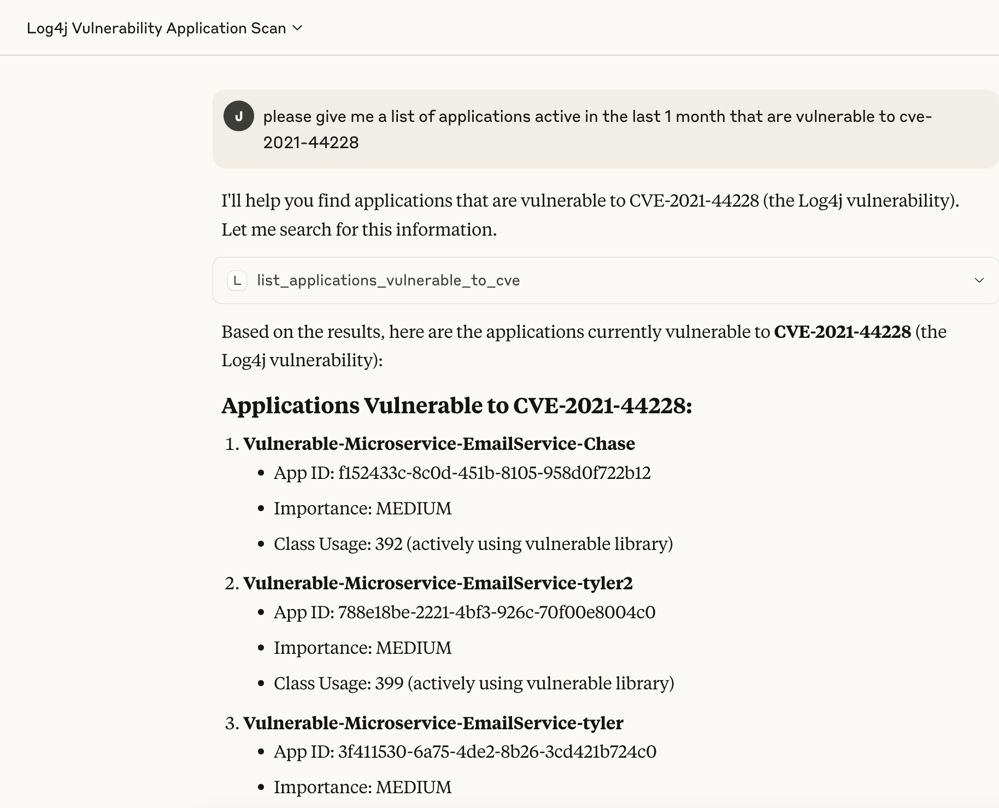
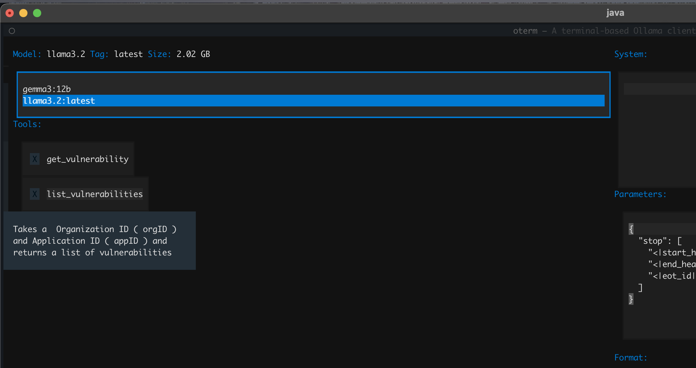
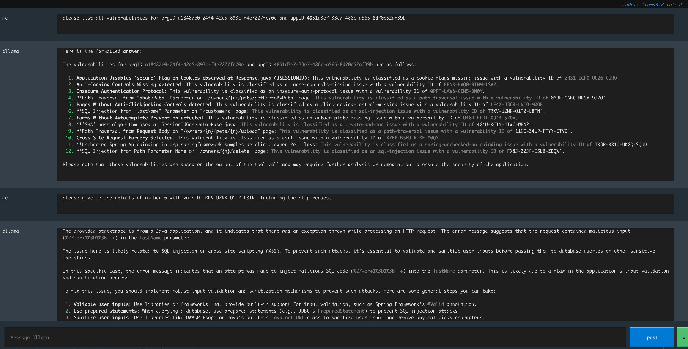

# Contrast MCP Server

$${\color{red} ** WARNING ** }$$

<h2><code style="color: red;">EXPOSING YOUR CONTRAST VULNERABILITY DATA TO A PUBLIC LLM IS DANGEROUS! </code>
</h2>

Never under any circumstances use mcp-contrast functions which pull sensitive data with a public LLM as it will potentially expose your vulnerability data to the outside world.
  
<br/><br/>

[](https://github.com/Contrast-Labs/mcp-contrast/actions/workflows/build.yml)
[](https://opensource.org/licenses/Apache-2.0)
[](https://search.maven.org/search?q=g:%22com.contrast.labs%22%20AND%20a:%22mcp-contrast%22)
[](https://insiders.vscode.dev/redirect/mcp/install?name=contrastmcp&config=%7B%22command%22:%22docker%22,%22args%22:%5B%22run%22,%20%22-e%22,%22CONTRAST_HOST_NAME%22,%20%22-e%22,%22CONTRAST_API_KEY%22,%20%22-e%22,%22CONTRAST_SERVICE_KEY%22,%20%22-e%22,%22CONTRAST_USERNAME%22,%20%22-e%22,%22CONTRAST_ORG_ID%22,%20%20%22-i%22,%20%22--rm%22,%20%22contrast/mcp-contrast:latest%22,%20%22-t%22,%20%22stdio%22%5D,%22env%22:%7B%22CONTRAST_HOST_NAME%22:%22example.contrastsecurity.com%22,%22CONTRAST_API_KEY%22:%22example%22,%22CONTRAST_SERVICE_KEY%22:%22example%22,%22CONTRAST_USERNAME%22:%22example@example.com%22,%22CONTRAST_ORG_ID%22:%22example%22%7D%7D)

Contrast's MCP server allows you as a developer or security professional to quickly remediate vulnerabilities found by Contrast products. By combining the abilities of a LLM and Coding Agent of your choice and Contrast's unique vulnerability data it is possible to easily remediate vulnerabilities in your code or 3rd party libraries.


## Table of Contents 
- [Sample Prompts](#sample-prompts)
  - [For the Developer](#for-the-developer)
    - [Remediate Vulnerability in code](#remediate-vulnerability-in-code)
    - [3rd Party Library Remediation](#3rd-party-library-remediation)
  - [For the Security Professional](#for-the-security-professional)
- [Data Privacy](#data-privacy)
- [Build](#build)
- [Run](#run)
- [Docker](#docker)
  - [Build Docker Image](#build-docker-image)
  - [Run with Docker](#run-with-docker)
  - [Using Copilot + Petclinic](#using-copilot--petclinic)
  - [Install via Link](#install-via-link)
  - [Manual Install of MCP Server](#manual-install-of-mcp-server)
  - [Using Cline Plugin](#using-cline-plugin)
  - [Using oterm](#using-oterm)
- [Proxy Configuration](#proxy-configuration)
  - [Java Process](#java-process)
  - [Docker](#docker-1)

## Sample Prompts
### For the Developer
#### Remediate Vulnerability in code
1. Please list vulnerabilities for Application Y
2. Give me details about vulnerability X on Application Y
3. Review the vulnerability X and fix it.

#### 3rd Party Library Remediation
1. Which libraries in Application X have vulnerabilities High or Critical and are also being actively used.
2. Update library X with Critical vulnerability to the Safe version.

* Which libraries in Application X are not being used?

#### Retrieving application based on Tags
* please give me the applications tagged with "backend"

#### Retrieving application based on Metadata
* please give me the applications with metadata  "dev-team" "backend-team"

#### Retrieving vulnerabilities based on Session Metadata
* give me the sesssion metadata for application x
* give me the vulnerabilities in the latest session for application X
* give me the vulnerabilities for session metadata "Branch Name" "feature/some-new-fix" for application X
* give me the route coverage for the latest session for application X
* give me the route coverage for session metadata "Branch Name" "feature/some-new-fix" for application X


### For the Security Professional
* Please give me a breakdown of applications and servers vulnerable to CVE-xxxx-xxxx
* Please list the libraries for application named xxx and tell me what version of commons-collections is being used
* Which Vulnerabilities in application X are being blocked by a Protect / ADR Rule?

## Data Privacy
The Contrast MCP Server provides a bridge between your Contrast Data and the AI Agent/LLM of your choice.
By using Contrast's MCP server you will be providing your Contrast Data to your AI Agent/LLM, it is your responsibility to ensure that the AI Agent/LLM you use complies with your data privacy policy.
Depending on what questions you ask the following information will be provided to your AI Agent/LLM.
* Application Details
* Application Rule configuration
* Vulnerability Details
* Route Coverage data
* ADR/Protect Attack Event Details

## Build
Requires Java 17+

`mvn clean install`

## Run
To add the MCP Server to your local AI system, modify the config.json file and add the following

```json
"mcpServers": {
    "contrast-mcp": {
      "command": "/usr/bin/java", "args": ["-jar","/Users/name/workspace/mcp-contrast/mcp-contrast/target/mcp-contrast-0.0.1-SNAPSHOT.jar",
        "--CONTRAST_HOST_NAME=example.contrastsecurity.com",
        "--CONTRAST_API_KEY=xxx",
        "--CONTRAST_SERVICE_KEY=xxx",
        "--CONTRAST_USERNAME=xxx.xxx@contrastsecurity.com",
        "--CONTRAST_ORG_ID=xxx"]
    }
}
```

You obviously need to configure the above to match your contrast API Creds.

## Docker

### Build Docker Image
```bash
docker build -t mcp-contrast .
```


### Using Copilot + Petclinic
Download the Vulnerable Pet Clinic.
`git clone https://github.com/Contrast-Security-OSS/vulnerable-spring-petclinic.git`
Open the project in VSCode or Intellij.
Edit the contrast_security.yaml file and configure it with your AGENT credentials
```yaml
api:
  url: https://xxx/Contrast
  api_key: xxx
  service_key: xxx
  user_name: xxx
# All other contrast config is done in the docker-compose file. Do not check this file in to git!
```
Then you can build and run using docker-compose
`docker compose up --build`
It will build and run the services that make up petclinic.
To build out the vulnerabilites and attack events run
`./testscript.sh`
Select option 25. ( this will exercise the app and perform attacks to populate the vulnerabilities and attack events)
#### Install via Link in VScode
Click following link  >>> [](https://insiders.vscode.dev/redirect/mcp/install?name=contrastmcp&config=%7B%22command%22:%22docker%22,%22args%22:%5B%22run%22,%20%22-e%22,%22CONTRAST_HOST_NAME%22,%20%22-e%22,%22CONTRAST_API_KEY%22,%20%22-e%22,%22CONTRAST_SERVICE_KEY%22,%20%22-e%22,%22CONTRAST_USERNAME%22,%20%22-e%22,%22CONTRAST_ORG_ID%22,%20%20%22-i%22,%20%22--rm%22,%20%22contrast/mcp-contrast:latest%22,%20%22-t%22,%20%22stdio%22%5D,%22env%22:%7B%22CONTRAST_HOST_NAME%22:%22example.contrastsecurity.com%22,%22CONTRAST_API_KEY%22:%22example%22,%22CONTRAST_SERVICE_KEY%22:%22example%22,%22CONTRAST_USERNAME%22:%22example@example.com%22,%22CONTRAST_ORG_ID%22:%22example%22%7D%7D) <<<
Allow the extension to be installed in your VSCode instance.
Select Install Server


This will install the MCP Server. You will need to configure the server with your Contrast API credentials.


#### Manual Install of MCP Server
In VSCode go to settings and search for "mcp"

Edit the Settings.json or select modify in workspace. If you want to enable this MCP sever just for this workspace.
Then add the following to the settings.json file.
```json
"mcp": {
    "inputs": [],
    "servers": {
        "contrastmcp": {
            "command": "docker",
            "args": [
            "run",
            "-e",
            "CONTRAST_HOST_NAME",
            "-e",
            "CONTRAST_API_KEY",
            "-e",
            "CONTRAST_SERVICE_KEY",
            "-e",
            "CONTRAST_USERNAME",
            "-e",
            "CONTRAST_ORG_ID",
            "-i",
            "--rm",
            "contrast/mcp-contrast:latest",
            "-t",
            "stdio"
            ],
            "env": {
                "CONTRAST_HOST_NAME": "example.contrastsecurity.com",
                "CONTRAST_API_KEY": "example",
                "CONTRAST_SERVICE_KEY": "example",
                "CONTRAST_USERNAME": "example@example.com",
                "CONTRAST_ORG_ID": "example"
            }
    }
}
```

Please note the credentials here are the API Credentials, not Agent credentials.
You should also see a small start button appear in the json file as you can see above. Click it to start the MCP server.

Once complete you should see the Contrast MCP Tools in the Tools drop down and you should be ready to perform queries!


#### Install in Intellij
To install the MCP Server in Copilot for Intellij.
1. Select the Agent Mode in Copilot
2. Click on the Tools drop down
3. Select add more tools
4. Add the below configuration to the mcp.json file
5. Add your credentials to the env section.
```json
{
  "servers": {
    "contrastmcp": {
      "command": "docker",
      "args": [
        "run",
        "-e",
        "CONTRAST_HOST_NAME",
        "-e",
        "CONTRAST_API_KEY",
        "-e",
        "CONTRAST_SERVICE_KEY",
        "-e",
        "CONTRAST_USERNAME",
        "-e",
        "CONTRAST_ORG_ID",
        "-i",
        "--rm",
        "contrast/mcp-contrast:latest",
        "-t",
        "stdio"
      ],
      "env": {
        "CONTRAST_HOST_NAME": "example.contrastsecurity.com",
        "CONTRAST_API_KEY": "example",
        "CONTRAST_SERVICE_KEY": "example",
        "CONTRAST_USERNAME": "example@example.com",
        "CONTRAST_ORG_ID": "example"
      }
    }
  }
}
```


### Using Cline Plugin
With the Cline plugin installed, select the MCP button in the top right corner of the screen.

Then select configure MCP Servers. This will open up a the JSON configuration for MCP.

Add the following the json configuration
```json
{
  "mcpServers": {
    "contrastmcp": {
      "command": "docker",
      "args": [
        "run",
        "-e",
        "CONTRAST_HOST_NAME",
        "-e",
        "CONTRAST_API_KEY",
        "-e",
        "CONTRAST_SERVICE_KEY",
        "-e",
        "CONTRAST_USERNAME",
        "-e",
        "CONTRAST_ORG_ID",
        "-i",
        "--rm",
        "contrast/mcp-contrast:latest",
        "-t",
        "stdio"
      ],
      "env": {
        "CONTRAST_HOST_NAME": "example.contrastsecurity.com",
        "CONTRAST_API_KEY": "example",
        "CONTRAST_SERVICE_KEY": "example",
        "CONTRAST_USERNAME": "example@example.com",
        "CONTRAST_ORG_ID": "example"
      },
      "disabled": false,
      "autoApprove": []
    }
  }
}
```
Once done you should see the contrast mcp server appear in the list of MCP servers, if you expand it you should see a list of available tools.


### Using Claude Desktop
Claude Desktop is a desktop application that allows you to use the Claude AI model locally. It can be configured to use the Contrast MCP server for enhanced functionality.
To setup Claude Desktop with the Contrast MCP server, follow these steps:
In Claude Desktop, go to the settings and then the Developer tab.

Then select Edit Config and edit the `claude_desktop_config.json` file.
Add the following configuration to the `claude_desktop_config.json` file:
```json
{
  "mcpServers": {
    "contrastmcp": {
      "command": "docker",
      "args": [
        "run",
        "-e",
        "CONTRAST_HOST_NAME",
        "-e",
        "CONTRAST_API_KEY",
        "-e",
        "CONTRAST_SERVICE_KEY",
        "-e",
        "CONTRAST_USERNAME",
        "-e",
        "CONTRAST_ORG_ID",
        "-i",
        "--rm",
        "contrast/mcp-contrast:latest",
        "-t",
        "stdio"
      ],
      "env": {
        "CONTRAST_HOST_NAME": "example.contrastsecurity.com",
        "CONTRAST_API_KEY": "xxx",
        "CONTRAST_SERVICE_KEY": "xxx",
        "CONTRAST_USERNAME": "xxx.xxx@example.com",
        "CONTRAST_ORG_ID": "xxx"
      }
    }
  }
}
```
Once you have added the configuration you will need to restart the Claude Desktop application for the change to take effect.
After you have restarted the application, you should be able to use Claude Desktop to interact with the Contrast MCP server. For example :



### Using oterm
oterm is  terminal wrapper for ollama. One of its features is the ability to add MCP servers to specific LLM Models.
https://ggozad.github.io/oterm/






## Proxy Configuration

### Java Process
If you need to configure a proxy for your Java process when using the standalone JAR, you can set the Java system properties for HTTP and HTTPS proxies:

```bash
java -Dhttp_proxy_host=proxy.example.com -Dhttp_proxy_port=8080 -jar /path/to/mcp-contrast-0.0.1-SNAPSHOT.jar --CONTRAST_HOST_NAME=example.contrastsecurity.com --CONTRAST_API_KEY=example --CONTRAST_SERVICE_KEY=example --CONTRAST_USERNAME=example@example.com --CONTRAST_ORG_ID=example
```

When configuring in your config.json file, include the proxy settings in the args array:

```json
"mcpServers": {
  "contrast-assess": {
    "command": "/usr/bin/java", 
    "args": [
      "-Dhttp_proxy_host=proxy.example.com", 
      "-Dhttp_proxy_port=8080",
      "-jar",
      "/Users/name/workspace/mcp-contrast/mcp-contrast/target/mcp-contrast-0.0.1-SNAPSHOT.jar",
      "--CONTRAST_HOST_NAME=example.contrastsecurity.com",
      "--CONTRAST_API_KEY=example",
      "--CONTRAST_SERVICE_KEY=example",
      "--CONTRAST_USERNAME=example@example.com",
      "--CONTRAST_ORG_ID=example"
    ]
  }
}
```

### Docker
When running the MCP server in Docker, you can configure the proxy by passing the relevant environment variables:


```bash
docker run \
  -e http_proxy_host="proxy.example.com" \
  -e http_proxy_port="8080" \
  -e CONTRAST_HOST_NAME=example.contrastsecurity.com \
  -e CONTRAST_API_KEY=example \
  -e CONTRAST_SERVICE_KEY=example \
  -e CONTRAST_USERNAME=example \
  -e CONTRAST_ORG_ID=example \
  -i \
  contrast/mcp-contrast:latest \
  -t stdio

```

For VS Code configuration with Docker and proxy, modify the settings.json like this:

```json
"mcp": {
  "inputs": [],
  "servers": {
    "contrast-mcp": {
      "command": "docker",
        "args": [
        "run",
        "-e",
        "CONTRAST_HOST_NAME",
        "-e",
        "CONTRAST_API_KEY",
        "-e",
        "CONTRAST_SERVICE_KEY",
        "-e",
        "CONTRAST_USERNAME",
        "-e",
        "CONTRAST_ORG_ID",
        "-e", "http_proxy_host",
        "-e", "http_proxy_port",
        "-i",
        "--rm",
        "contrast/mcp-contrast:latest",
        "-t",
        "stdio"
        ],
        "env": {
            "CONTRAST_HOST_NAME": "example.contrastsecurity.com",
            "CONTRAST_API_KEY": "example",
            "CONTRAST_SERVICE_KEY": "example",
            "CONTRAST_USERNAME": "example@example.com",
            "CONTRAST_ORG_ID": "example",
            "http_proxy_host": "proxy.example.com",
            "http_proxy_port": "8080"
        }
    }
  }
}
```

## Common Issues
If you are experiencing issues with the MCP server, here are some common troubleshooting steps:
### Review Log
A log will be created, by default under `/tmp/mcp-contrast.log` either locally or witin the docker container. You can view this log to see if there are any errors or issues with the MCP server.

### Enable Debug Logging
To enable debug logging you can add the following flag to the command line arguments when running the MCP server:
`--logging.level.root=DEBUG`
This can be added at this part of the docker command 
```
        "--rm",
        "contrast/mcp-contrast:latest",
        "-t",
         "--logging.level.root=DEBUG",
        "stdio"
        ],
```

### Certificate Issues
If the SSL Certificate for the Teamserver URL is not trusted, you may see the following error:
```
Failed to list applications: PKIX path building failed: sun.security.provider.certpath.SunCertPathBuilderException: unable to find valid certification path to requested target
```
If this occurs you will need to add the certificate to the Java Truststore and then add the following to the command line arguments when running the MCP server:
`-Djavax.net.ssl.trustStore=/loctaion/to/mcp-truststore.jks, -Djavax.net.ssl.trustStorePassword=yourpassword`
More details on how to do this can be found in the [Java documentation](https://docs.oracle.com/cd/E19509-01/820-3503/6nf1il6er/index.html). Or ask your LLM to help you with this.


