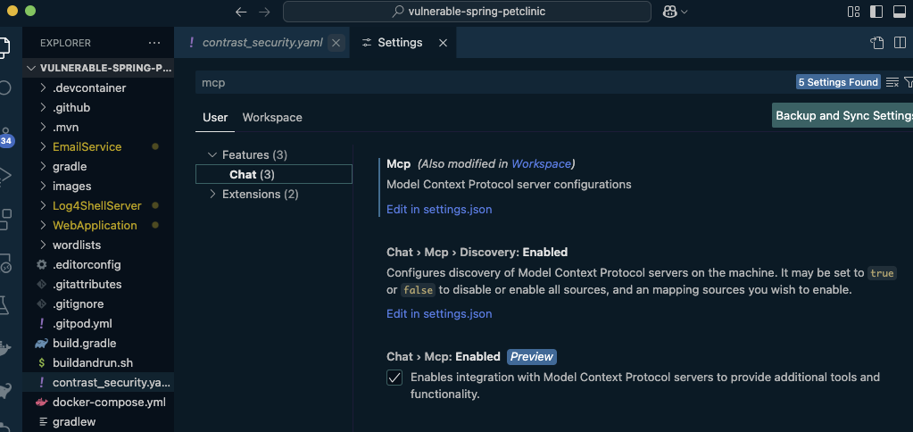
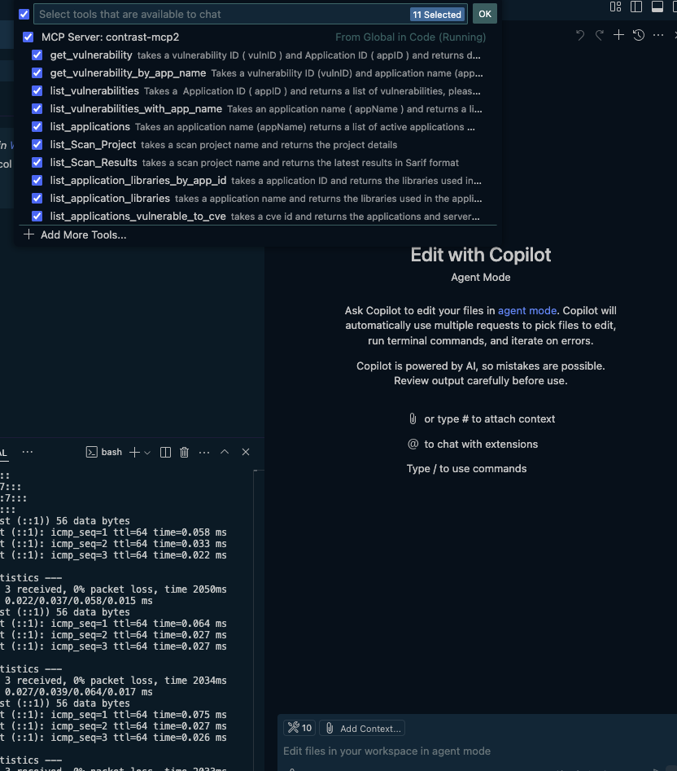

# Installing Contrast MCP Server in VS Code (GitHub Copilot)

This guide covers how to install and configure the Contrast MCP Server in VS Code with GitHub Copilot.

> [!NOTE] Official VS Code Documentation Reference
> VS Code's full documentation for MCP servers can be found here: https://code.visualstudio.com/docs/copilot/customization/mcp-servers

## Prerequisites

- VS Code with GitHub Copilot installed
- Contrast API credentials ([how to get API credentials](https://docs.contrastsecurity.com/en/personal-keys.html))
- **Choose one deployment method:**
  - Docker (recommended for one-click install)
  - Java 17+ and the built JAR file

## Installation Methods

### Option 1: One-Click Install with Docker (Recommended)

Click the button below to automatically install the Contrast MCP Server in VS Code:

[](vscode:mcp/install?%7B%22name%22%3A%22contrast%22%2C%22type%22%3A%22stdio%22%2C%22command%22%3A%22docker%22%2C%22args%22%3A%5B%22run%22%2C%22-e%22%2C%22CONTRAST_HOST_NAME%22%2C%22-e%22%2C%22CONTRAST_API_KEY%22%2C%22-e%22%2C%22CONTRAST_SERVICE_KEY%22%2C%22-e%22%2C%22CONTRAST_USERNAME%22%2C%22-e%22%2C%22CONTRAST_ORG_ID%22%2C%22-i%22%2C%22--rm%22%2C%22contrast%2Fmcp-contrast%3Alatest%22%2C%22-t%22%2C%22stdio%22%5D%2C%22env%22%3A%7B%22CONTRAST_HOST_NAME%22%3A%22%24%7Binput%3Acontrast_host_name%7D%22%2C%22CONTRAST_ORG_ID%22%3A%22%24%7Binput%3Acontrast_org_id%7D%22%2C%22CONTRAST_USERNAME%22%3A%22%24%7Binput%3Acontrast_username%7D%22%2C%22CONTRAST_API_KEY%22%3A%22%24%7Binput%3Acontrast_api_key%7D%22%2C%22CONTRAST_SERVICE_KEY%22%3A%22%24%7Binput%3Acontrast_service_key%7D%22%7D%7D)

This will automatically configure VS Code to use input variables for secure credential handling.

### Option 2: Manual Installation (Docker)

#### Step 1: Open VS Code Settings

1. In VS Code, open Settings (Cmd/Ctrl + ,)
2. Search for "mcp"
3. You should see the MCP settings section



#### Step 2: Choose Configuration Scope

- Click "Edit in settings.json" for user-level configuration (applies to all workspaces)
- Or click "Modify in workspace" to enable the MCP server just for the current workspace

See [Workspace vs User Settings](#workspace-vs-user-settings) for more details on choosing the right scope.

#### Step 3: Add Configuration

Add the following configuration to your `settings.json`:

```json
"contrast": {
  "inputs": [
    {
      "type": "promptString",
      "id": "contrast_host_name",
      "description": "Your Contrast Server's host name (without https://)"
    },
    {
      "type": "promptString",
      "id": "contrast_org_id",
      "description": "Your Contrast Organization ID."
    },
    {
      "type": "promptString",
      "id": "contrast_username",
      "description": "Your Contrast User Name (Usually your email)."
    },
    {
      "type": "promptString",
      "id": "contrast_api_key",
      "description": "API key for your Contrast Installation.",
      "password": true
    },
    {
      "type": "promptString",
      "id": "contrast_service_key",
      "description": "Service key for your Contrast Installation.",
      "password": true
    }
  ],
  "command": "docker",
  "args": [
    "run",
    "-e",
    "CONTRAST_HOST_NAME",
    "-e",
    "CONTRAST_API_KEY",
    "-e",
    "CONTRAST_SERVICE_KEY",
    "-e",
    "CONTRAST_USERNAME",
    "-e",
    "CONTRAST_ORG_ID",
    "-i",
    "--rm",
    "contrast/mcp-contrast:latest",
    "-t",
    "stdio"
  ],
  "env": {
    "CONTRAST_HOST_NAME": "${input:contrast_host_name}",
    "CONTRAST_ORG_ID": "${input:contrast_org_id}",
    "CONTRAST_USERNAME": "${input:contrast_username}",
    "CONTRAST_API_KEY": "${input:contrast_api_key}",
    "CONTRAST_SERVICE_KEY": "${input:contrast_service_key}"
  }
}
```

#### Step 4: Start the MCP Server

After adding the configuration, you should see a small start button appear in the JSON file. Click it to start the MCP server.

### Option 3: JAR Deployment

If you prefer to run the JAR directly (requires Java 17+):

```json
"contrast": {
  "command": "java",
  "args": [
    "-jar",
    "/path/to/mcp-contrast-X.X.X.jar",
    "--CONTRAST_HOST_NAME=example.contrastsecurity.com",
    "--CONTRAST_API_KEY=your_api_key",
    "--CONTRAST_SERVICE_KEY=your_service_key",
    "--CONTRAST_USERNAME=your_username",
    "--CONTRAST_ORG_ID=your_org_id"
  ]
}
```

**Getting the JAR file:**
- **Download** from [GitHub Releases](https://github.com/Contrast-Security-OSS/mcp-contrast/releases/latest) (recommended)
- **Build** from source ([instructions](../../README.md#build-from-source))

Replace `/path/to/mcp-contrast-X.X.X.jar` with the path to your downloaded or built JAR file and update the credential values.

> 📝 **Note:** JAR deployment doesn't support VS Code's input variables feature. Credentials must be specified directly or via environment variables.

## Verify Installation

Once configured, you should see the Contrast MCP Tools in the Tools dropdown:



Test with a query like: "List applications in Contrast"

## Configuration Notes

### Input Variables with Password Protection

VS Code supports input variables with the `password: true` flag, which provides secure credential handling:

- **Credentials are prompted when needed**: VS Code will prompt you to enter credentials when the MCP server starts
- **Password masking**: API keys and service keys are masked during input
- **Secure storage**: Credentials are stored securely by VS Code
- **No plain text in config**: Credentials don't appear in your settings file

### Credential Types

- **CONTRAST_HOST_NAME**: Your Contrast instance hostname (without `https://`)
- **CONTRAST_API_KEY**: Your API key from Contrast (marked as password)
- **CONTRAST_SERVICE_KEY**: Your service key from Contrast (marked as password)
- **CONTRAST_USERNAME**: Your Contrast username (usually your email)
- **CONTRAST_ORG_ID**: Your organization ID from Contrast

> 📝 **Note:** The credentials here are the API Credentials, not Agent credentials.

## Workspace vs User Settings

### User Settings
- Configuration applies to all VS Code workspaces
- Stored in: `~/Library/Application Support/Code/User/settings.json` (macOS)
- Use when you want Contrast MCP available everywhere

### Workspace Settings
- Configuration applies only to the current workspace
- Stored in: `.vscode/settings.json` in your project
- Use when you want different Contrast configurations per project
- ⚠️ **Warning:** Don't commit workspace settings with credentials to version control

## Troubleshooting

If you encounter issues:

1. **Docker not found**: Ensure Docker is installed and running
2. **Start button not appearing**: Check JSON syntax is valid
3. **Connection errors**: Verify your Contrast credentials are correct
4. **Tools not appearing**: Restart VS Code after adding configuration
5. **Image not found**: Pull the latest image manually:
   ```bash
   docker pull contrast/mcp-contrast:latest
   ```

**Check VS Code Output:**
- Open View → Output
- Select "MCP Servers" from the dropdown
- Look for error messages or connection status

For more troubleshooting help, see the [Common Issues](../../README.md#common-issues) section in the main README.

## Proxy Configuration

If you're behind a corporate proxy, see the [Proxy Configuration](../../README.md#proxy-configuration) section in the main README.
